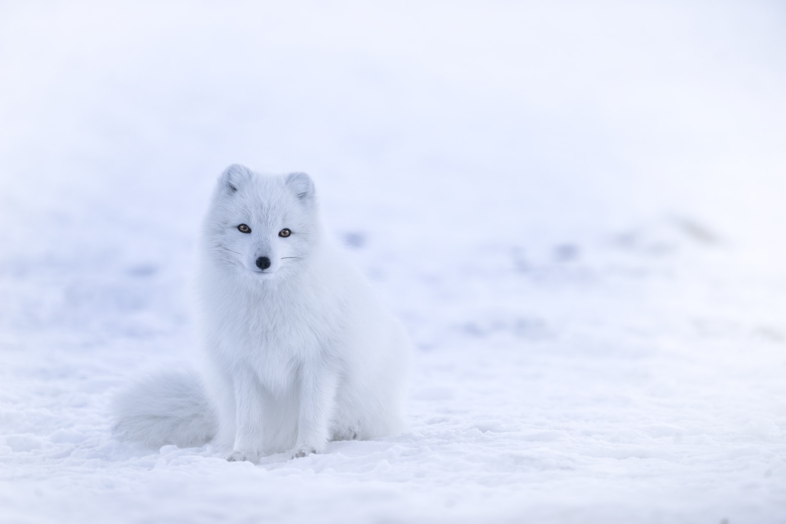

Hello, this is my first blog post on my first ever portfolio website and a blog. How exciting is that!

Just below this line, you should see an amazing arctic fox.



And some nicely highlighted javascript syntax:

```javascript
const foo = 123;
Object.is(0, -0); // false
Object.is(-0, 0); // true
```

And some css:

```css
:root {
  font-size: 20px;
}

.test::before {
  content: "hello";
}
```

Hopefully I will post something more interesting in the future <span role="img" aria-label="smiley face">😅</span>.
